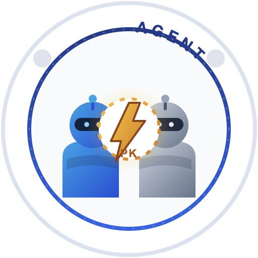

<p align="center">
  
</p>

<h1 align="center">DUO AI AGENT ⚔️</h1>
<p align="center">双 AI 在线辩论擂台 · 自由站队 · 实时对辩 · 判官裁决</p>

两位大模型收到你的辩题后，**先独立思考并自行选择正方 / 反方**——观点一致直接握手言和（平局），观点对立则开启回合制 PK 辩论，最终由 DeepSeek 判官裁决胜负。无需注册，任何人在线围观、回看历史战报。

## ✨ 核心玩法

- **不预设正反方**：站队由模型独立判断，正反方归属完全由 AI 自己决定
- **PK 格斗体验**：站队翻牌动画、双方血条、每轮各扣 `1/轮数` 血量、裁判审议动画、胜利彩带
- **自由轮数**：1～1000 轮，每轮双方各发言一次，绝不弃权
- **DeepSeek 判官**：基于完整辩论实录输出结构化裁决——胜者、比分、理由、全场金句
- **多人在线围观**：SSE 实时推送（站队、发言流、裁判、胜负），无需注册即可围观与回看

## 🚀 快速开始

零依赖，Node 18+ 即可运行：

```bash
node server.js
```

- 对战擂台：<http://localhost:3000>
- 设置大模型（管理后台）：<http://localhost:3000/admin>，默认密码 `admin123`
- 建议通过环境变量修改管理员密码：`ADMIN_PASSWORD=xxx node server.js`

## ⚙️ 设置大模型

两个辩手与裁判的接口都可在后台**在线填写**：Base URL、接口类型、模型名、API Key，并支持一键测试连接。

支持三种接口类型：

| 接口类型 | 说明 |
| --- | --- |
| OpenAI Chat Completions | `/chat/completions`，兼容 DeepSeek / 豆包(Ark) / 各类中转网关 |
| OpenAI Responses | `/responses` |
| Manus 任务式接口 | `/v2/task.create` + 轮询，支持结构化输出站队 |

密钥只保存在服务器 `data/keys.json`（权限 600），**永不发送到浏览器**，也不会提交到 Git。

## 🔐 安全

- `data/` 已加入 `.gitignore`，密钥与辩论历史都不会进入仓库
- 管理后台密码登录；创建辩题每 IP 限流 12 场 / 10 分钟
- 模型调用自动重试（5xx / 429 / 网络中断），服务重启后自动恢复未完成场次

## 🏗️ 生产部署

```bash
ADMIN_PASSWORD=xxx pm2 start server.js --name duo-ai-agent
```

建议前置 Nginx / Caddy 反向代理并启用 HTTPS。

## 📁 项目结构

```text
server.js           零依赖服务端：辩论队列、SSE 实时推送、裁判流程
public/             前端页面（原生 HTML/CSS/JS，无框架）
  index.html        对战擂台（首页直接发起辩论）
  admin.html        设置大模型（管理后台）
  logo.svg          DUO AI AGENT 徽章 logo
assets/logo.png     GitHub 展示用 logo
data/               密钥与辩论数据（本地，不提交）
test/mock-api.js    离线模拟接口，可用于无密钥联调
```

## 🤝 一场辩论的完整流程

```text
用户提问
  → 两位辩手并行独立站队（思考过程实时可见）
      ├─ 观点一致 → 🤝 握手言和 · 平局
      └─ 观点对立 → ⚔️ 开战
  → 每轮：正方先发言 → 反方反驳（双方各扣 1/轮数 血量）
  → 轮数耗尽 → ⚖️ DeepSeek 判官审议并输出裁决
  → 🏆 胜利动画 + 比分 / 理由 / 全场金句
```
